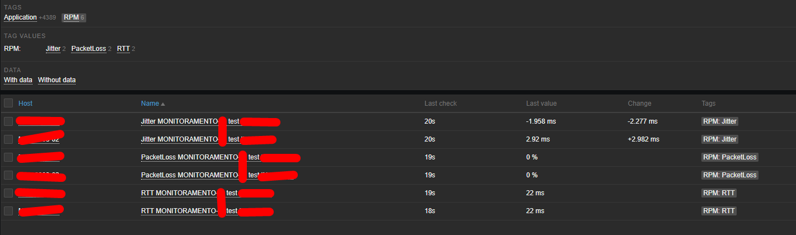

# Juniper RPM Template for Zabbix (version 6.4)

If you are running Juniper network devices and need to monitor SLA metrics across your links, you have likely considered using RPM (Real-Time Performance Monitoring).

This template enables you to collect and send RPM metrics from Juniper devices to Zabbix.




## 1. Juniper Device Configuration

First, configure RPM tests on your Juniper device. Example:

```sh
services {
    rpm {
        probe Bee {
            test Jitter {
                probe-type icmp-ping-timestamp;
                target address 2.2.2.2;
                probe-count 15;
                probe-interval 1;
                test-interval 15;
                source-address 2.2.2.1;
                data-size 1400;
                thresholds {
                    successive-loss 2;
                }
                hardware-timestamp;
            }
        }
        probe GARS {
            test Jitter {
                probe-type icmp-ping-timestamp;
                target address 1.1.1.2;
                probe-count 15;
                probe-interval 1;
                test-interval 15;
                source-address 1.1.1.1;
                data-size 1400;
                thresholds {
                    successive-loss 2;
                }
                hardware-timestamp;
            }
        }
    }
}
```

## 2. Zabbix Server Setup

Perform the following steps on your Zabbix server:

* Move the script `discovery_juniper_rpm.py` to:

  ```
  /usr/lib/zabbix/externalscripts
  ```
* Install the required dependency:

  ```bash
  sudo python3 -m pip install pysnmp
  ```
* Test the script manually:

  ```bash
  sudo python3 discovery_juniper_rpm.py 10.1.1.1 public
  ```
* Set proper permissions:

  ```bash
  chmod +x discovery_juniper_rpm.py
  chown zabbix:zabbix discovery_juniper_rpm.py
  ```
* Import the template:

  ```
  template-juniper-rpm.xls
  ```
* Apply the template to your Juniper host in Zabbix
* Ensure the macro `{$SNMP_COMMUNITY}` is configured on the host

## 3. How It Works

Within a few minutes (typically around 5 minutes), the discovery script will automatically detect RPM tests and create:

* Items
* Triggers
* Graphs

for each configured test.

## Notes

* Review the timing settings in the *item prototypes*.
* The intervals used in this example are quite aggressive and may not be suitable for all environments.

## Credits

Based on:
[https://github.com/comsourcecz/zabbix-recipes/tree/master/juniper-rpm-template](https://github.com/comsourcecz/zabbix-recipes/tree/master/juniper-rpm-template)
